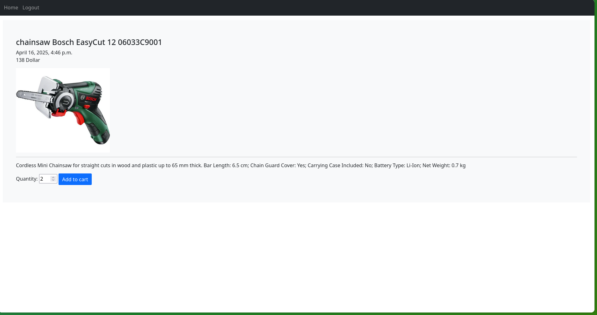
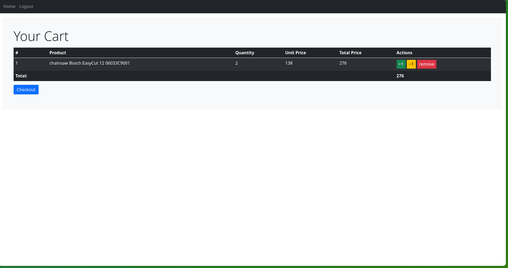
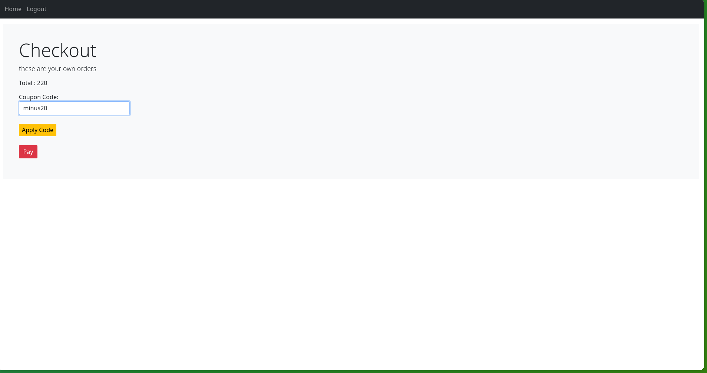
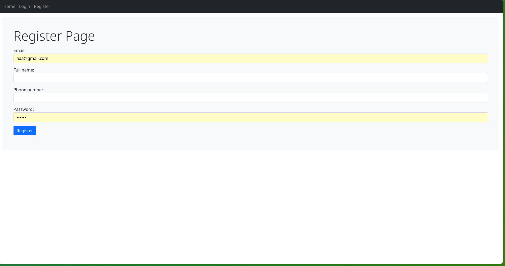

# 🏩 Django Online Shop

This is a fully functional **online store** built with **Django**, featuring product listings, categories with subcategories, a shopping cart, order processing, and user authentication.

---

## 🚀 Features

- 📦 Product catalog with categories and subcategories
- 🛒 Shopping cart (add/remove/increase/decrease quantity)
- 🔐 User registration, login, logout
- 💰 Order creation and (test) payment handling
- 🍻 Apply discount coupons during checkout
- 📁 Product images served from GitHub repository
- ✅ Custom admin panel for managing products, orders, and coupons
- 🧪 Pytest + Tox test suite with 90%+ coverage

---

## 🧠 Technologies

- Django 4.x
- Python 3.11
- MySQL
- Bootstrap 5
- Pytest / Tox for testing
- Sorl-thumbnail for image handling

---

## 🛠️ Setup & Installation

1. **Clone the repo**
   ```bash
   git clone https://github.com/your-username/django-online-shop.git
   cd django-online-shop
   ```

2. **Create virtual environment**
   ```bash
   python3 -m venv venv
   source venv/bin/activate
   ```

3. **Install dependencies**
   ```bash
   pip install -r requirements.txt
   ```

4. **Configure your database** (in `settings.py`)

5. **Run migrations**
   ```bash
   python manage.py migrate
   ```

6. **Create superuser**
   ```bash
   python manage.py createsuperuser
   ```

7. **Run the server**
   ```bash
   python manage.py runserver
   ```

---

## 🧪 Running Tests

Run all tests via:

```bash
pytest
```

Or use Tox to run tests across environments:

```bash
tox
```

---

## 📁 Project Structure

```
├── accounts/          # Custom user model and auth views
├── cart/              # Shopping cart logic
├── orders/            # Orders, checkout, coupons
├── shop/              # Product and category models
├── templates/         # HTML templates
├── media/             # Uploaded product images (local only)
└── django_online_shop # Core settings and URL configuration
```

---

## 📸 Screenshots






---

## 📜 License

This project is for educational purposes only and is licensed under the MIT License.

---

## 👤 Author

- Developed by UrMyEcstasy(https://github.com/UrMyEcstasy)

